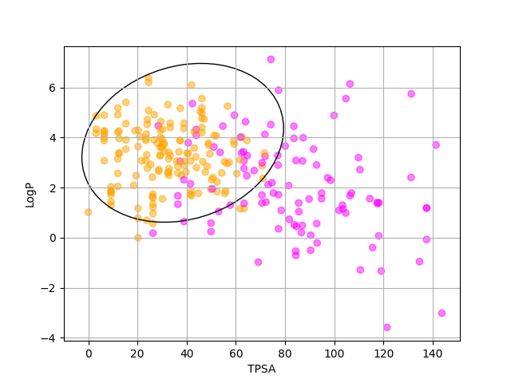
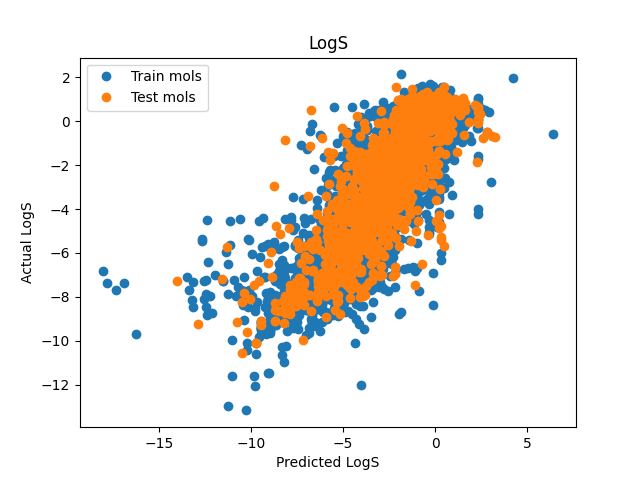

# Flower Pot

This program (flowerpot.py) provides an interactive graphical user interface for a small set of models and tools for the calculation of pharmacologically relevant chemical properties. Implemented are estimations of water solubility (LogS), the logarithm of the octanol-water partition coefficient (LogP), lipophilicity at pH 7.4 (LogD) and topological polar surface area (TPSA). This program provides substructure filters checking for potential toxicophores, as well as an adapted version of the BOILED-EGG model by Daina and Zoete [1], which estimates the gastrointestinal absorption of a molecule and its ability to permeate the blood-brain barrier, that we refer to as t**H**e **A**djusted **RD**Kit **BOILED-EGG** (HARDBOILED-EGG). In addition, if the molecular docking programs Autodock Vina or GOLD are installed on the current system, then this program will also allow the user to run molecular docking calculations on their input molecules and will process the main results.

## Installation

We have written installation scripts for Windows (`windows_install.bat`), macOS (`macos_install.sh`) and Linux (`linux_install.sh`)

First, clone this repository from GitHub:

```
git clone https://github.com/toboooo/flower_pot.git
```

The next, optional, but recommended step is to create a Python virutal environment:

```
python -m venv flowerenv
```

Then activate the environment. On Windows use:

```
.\flowerenv\Scripts\activate

```

Or if on Linux/MacOS:

```
source flowerenv/bin/activate
```

Then install the required libraries:

```
pip install -r flower_pot/requirements.txt
```

Now change into the cloned directory:

```
cd flower_pot
```

And the program should be ready to use.

## Usage

In order to start the GUI, simply run the main Python script from the command line:

```
python flowerpot.py
```

Once started, the GUI presents the user with two text boxes and a set of options specifying the desired inputs and outputs. The left text box allows the user to enter the SMILES strings of a series of molecules, each on a new line, for which the properties are to be calculated.

The middle area provides an option to provide an spreadsheet file that may be used instead of, or in conjunction with, the SMILES strings input text box. This input spreadsheet may contain column headings in its first row titled "smiles" and "name" or "names" (case-insensitive) to specify the columns containing the SMILES strings of the input molecules and any particular labels these molecules are to be associated with. If the "smiles" heading is not found in the input spreadsheet, the program will search the first row for the first column to contain a valid SMILES string, and will use this column to find the input molecules. The name of an output file to which the results will be written may also be specified in a separate field.

The input and output files may be .csv files or .xlsx spreadsheets (unfortunately older .xls files are not supported). If using an Excel spreadsheet, the program will only look in the first worksheet of the file, and therefore the SMILES strings and optional names associated with the molecules must be on the first worksheet.

A set of check buttons allow the user to select the calculations of which properties will be performed. The selection of the "Print EGG" or any of the "Substructure Filters" options will also create a pop-up window displaying the visualisations of the HARDBOILED-EGG model or any detected toxicophores.

The user may also request that docking calculations are performed for each of the input molecules on a selection of target proteins, using either Autodock Vina or GOLD. These docking scores can also be used in an estimation of each compound's $\\mathrm{IC}\_{50}$ that is suitable for teaching purposes only. In order to use the molecular docking feature, the "docking" directory, and all of the data files therein, must be present in the same working directory as the program. In order to use Autodock Vina for docking calculations, the "vina" executable must be available on the system PATH. The easiest way to achieve this is to locate the Autodock Vina installation folder and add the "bin" directory to the system PATH environment variable. In order to use GOLD, the installation folder must be provided to the program. This can either be achieved by entering the path into the box labelled "GOLD installation path:" at runtime or if one wishes to specify the installation directory persistently, the install path may be written to the first line of a text file called `GOLD_INSTALLDIR.txt` that is saved in the same working directory as the program. If neither of the above options are provided, the program will perform a short search into some pre-determined default guess directories to try to find an installation of GOLD. The above-mentioned GOLD installation directory must be the one in which the "GOLD" (note the upper-case letters) directory can be found. Note this must not be a lower-case "gold" folder or the "GOLD" folder itself, but the folder within which "GOLD" may be found. The docking calculations will not work if any other directory is provided.

Clicking the "Go" button performs the calculations and writes the outputs to the right text box, as well as the specified output spreadsheet, if provided.

## Dependencies

This code was tested using Python version 3.9.18, and the following libraries. Whilst the program should not be highly sensitive to the specific version numbers, the meeko library that creates and formats Autodock Vina files currently requires the Python version to be at least 3.9, but no higher than 3.11.

* The standard library (os, sys, re, csv, tkinter, math, pathlib, multiprocessing, subprocess, datetime)
* numpy==1.26.4
* rdkit==2023.9.5
* matplotlib==3.8.4
* openpyxl==3.1.2
* meeko==0.5.1
* scipy==1.13.0

## Methods

### HARDBOILED-EGG

The BOILED-EGG model of Daina and Zoete [1] describes molecules in two variables, TPSA and LogP, and uses two classifying ellipses in this space to determine whether a molecule is likely to first be absorbed gastrointestinally and second whether it is likely to permeate the blood-brain barrier. In our implementation, we calculate TSPA and LogP values using the RDKit descriptors module, however these give slighty different values compared with the TPSA and LogP calculations used in the original publication. This means that the original ellipse parameters (which are the Cartesian coordinates of the two foci of the ellipse, (x<sub>1</sub>, y<sub>1</sub>) and (x<sub>2</sub>, y<sub>2</sub>), as well as the length of the major axis, *d*) need to be slightly adjusted in order to better fit the RDKit data. To achieve this, we acquired the human intestinal absorption (HIA) and blood-brain barrier (BBB) datasets from reference [1] (which may be found within the "boiled_egg" folder as "hia_mols.csv" and "bbb_mols.csv") and performed 10 independant Monte Carlo optimisation routines, in a very similar manner as described in the original paper, starting from the ellipse parameters from the original BOILED-EGG model. The best of the resulting optimised ellipse parameter vectors for each of the HIA and BBB datasets were then used to describe the classifying ellipses for t**H**e **A**djusted **RD**Kit **BOILED-EGG** (HARDBOILED-EGG), which are shown in Figures 1 to 3. These classifying ellipses achieve Matthews correlation coefficients of 0.69 (HIA) and 0.74 (BBB), which are in agreement with the values from the original BOILED-EGG model.


**Figure 1.** The classifying ellipse for the gastrointestinal absorption predictions. Molecules falling withing the black ellipse are classified as absorbed by the intestine. Green data points correspond to molecules from the HIA dataset that are absorbed and blue data points correspond to molecules that are not absorbed.



**Figure 2.** The classifying ellipse for the blood-brain barrier permeation predictions. Molecules falling withing the black ellipse are classified as permeating the blood-brain barrier. Orange data points correspond to molecules from the BBB dataset that permeate the blood-brain barrier and pink data points correspond to molecules that do not.


**Figure 3.** The full HARDBOILED-EGG model with the HIA and BBB data points superimposed atop the "egg". The BBB classifier is shown as the yellow "yolk" and the HIA classifier is shown as the "white" of the egg.

### Physiochemical Properties

The TPSA and LogP calculations were performed using the RDKit library and the appropriate functions are thus trivally called when required. For the calculation of LogS and LogD, we chose to use the atomic contribution method of Wildman and Crippen [2], that is also used in the RDKit implementation of the prediction of LogP. This model estimates the value of a property as a sum of contributions from each atom in the molecule, given by

$$\\mathrm{LogX} = \\sum_i n_i a_i$$

where $i$ indexes each atom type known to the model, $n_i$ corresponds to the number of atoms of type $i$ within the molecule and $a_i$ represents the contribution of atom type $i$ to the total property value of the molecule. We used the same set of atom types as used in the RDKit implementation of Crippen's LogP calculations (the SMARTS strings of these atom types are available from [3]). For LogS, we acquired the AqSolDBc compiled solubility dataset from Llompart *et al.* [4], which consists of 9982 molecules and experimental solubility measurements (this data may be found in our file "log_models/solubility.csv"). For LogD, we utilised the lipophilicity dataset from the MoleculeNet benchmark [5] and supplemented this with the molecules in the dataset by Wang *et al.* [6] that were not already in the MoleculeNet dataset. This gave a total of 5147 molecules with experimental LogD measurements, and this combined dataset may be found in the file "log_models/lipophilicity.csv".

With the datasets obtained, we extracted counts of each of the Crippen atom types for all of the molecules in each dataset, randomly split 80% of the molecules in each dataset into a "training" set and added the remaining 20% to a "test" set, and then used the linear least-squares solver from the numpy python library to obtain the $a_i$ atom type contribution coefficients from each training set. The mean absolute error (MAE) for the LogS model on the testing data was found to be 1.09 log units and the MAE for the LogD model on the testing data was found to be 0.80 log units. Scatter plots for the predictions of both models are shown in Figures 4 and 5.



**Figure 4.** Scatter plot showing the predicted versus actual LogS values for all molecules in the solubility dataset. Training data points are shown in blue, testing points are shown in orange.


**Figure 5.** Scatter plot showing the predicted versus actual LogD values for all molecules in the Lipophilicity dataset. Training data points are shown in blue, testing points are shown in orange.

Following analysis of the model performances, we recombined the training and testing sets and reperformed the least-squares fitting on the entirety of the datasets to obtain the atom contribution coefficents for the final LogS and LogD models.

### Substructure Filters

We also provide implementations of the PAINS [7], Brenk [8] and NIH [9,10] substructure filters, which are straightforwardly implemented by aquiring the corresponding lists of SMARTS strings for each of the filters from the RDKit library (found in the csv files in the "substructure" folder), and using RDKit again to detect substructure matches from the filters and highlight them to the user.

### Molecular Docking

Docking calculations using either Autodock Vina [11,12] or GOLD [13] may be performed against a set of five target proteins named: "26S_proteasome", "BTHalpha", "CF-IIbeta", "CHK1" and "CYP17a", with their structure files saved under the corresponding directories in the "docking" folder. Before docking, each molecule is embedded in 3D coordinates using RDKit and (if possible) its geometry is optimised using the MMFF94 force field [14] as implemented in RDKit. Once the docking score calculation is completed, the best poses found will be saved into a directory named "ligand_best_poses" in the same working directory from which flowerpot.py was run.

For docking with Autodock Vina, the exhaustiveness parameter for the calculations is set to a value of 8 and the size of the box is set to 20.0 Angstrom in the x, y, and z directions. These settings may be found in the "*\_config.txt" files within each of the target protein directories in the "docking" folder.

For docking with GOLD, the calculation settings are defined in the "gold.conf" files within each target protein's directory within the "docking" folder, with the receptor binding site defined by the "cavity.atoms" file.

When docking scores are calculated, the resulting values may be used to perform estimations of $\\mathrm{IC}\_{50}$ that may be used for teaching purposes, based on the difference between a current molecule's docking score and that of a reference molecule which shows a good binding affinity for a selected protein. The equation used for these calculations is:

$$\\mathrm{IC}\_{50} = p * 2^{-\\Delta d / s}$$

where $\\Delta d$ is the difference between the current molecule's docking score and that of the reference molecule, p is a prefactor (set to a value of 0.5) and s is a scale factor (set to a value of 10). The purpose of these calculations is to provide students with an estimation of their molecule's binding quality, which increases rapidly as they make changes which make its binding affinity closer to, but below, that of the reference molecule, but also yields diminishing returns as the binding affinity is increased above that of the reference molecule. The reference values for each of the five target proteins were calculated from the following molecules (as represented by their SMILES strings):

* 26S_proteasome: ```CC(C)C[C@H](NC(=O)[C@H](Cc1ccccc1)NC(=O)c1cnccn1)B(O)O```
* BTHalpha: ```Cc1ccc(NC(=O)c2ccc(CN3CCN(C)CC3)cc2)cc1Nc1nccc(-c2cccnc2)n1```
* CF-IIbeta: ```O=C(NC[C@H]1CN(c2ccc(N3CCOCC3=O)cc2)C(=O)O1)c1ccc(Cl)s1```
* CHK1: ```CN1CCN(c2ccc(-c3cnc4[nH]cc(NC(=O)c5cccnc5)c4c3)cc2)CC1```
* CYP17a: ```C[C@]12CC[C@H](O)CC1=CC[C@@H]1[C@@H]2CC[C@]2(C)C(c3cccnc3)=CC[C@@H]12```

Note however that boron is not available as a valid atom type in Autodock Vina, therefore the reference value for 26S_proteasome in Autodock Vina was calculated from the SMILES string resulting from the replacement of the boron atom with carbon.

## References

[1]. A. Daina and V. Zoete, A BOILED-Egg To Predict Gastrointestinal Absorption and Brain Penetration of Small Molecules, *ChemMedChem*, 2016, **11**, 1117-1121, DOI: 10.1002/cmdc.201600182.

[2]. S. A. Wildman and G. M. Crippen, Prediction of Physicochemical Parameters by Atomic Contributions, *J. Chem. Inf. Comput. Sci.*, 1999, **39**, 868–873, DOI: 10.1021/ci990307l.

[3]. rdkit/Data/Crippen.txt, https://github.com/rdkit/rdkit/blob/master/Data/Crippen.txt, [accessed May 2024].

[4] P. Llompart, C. Minoletti, S. Baybekov, D. Horvath, G. Marcou and A. Varnek, Will we ever be able to accurately predict solubility?, *Sci. Data*, 2024, **11**, 303, DOI: 10.1038/s41597-024-03105-6.

[5]. Z. Wu, B. Ramsundar, E. N. Feinberg, J. Gomes, C. Geniesse, A. S. Pappu, K. Leswingd and V. Pande, MoleculeNet: a benchmark for molecular machine learning, *Chem. Sci.*, 2018, **9**, 513-530, DOI: 10.1039/C7SC02664A.

[6]. J.-B. Wang, D.-S. Cao, M.-F. Zhu, Y.-H. Yun, N. Xiao, Y.-Z. Liang, In silico evaluation of logD7.4 and comparison with other prediction methods, *J. Chemomet.* 2015, **29**, 389-398, DOI: 10.1002/cem.2718.

[7]. J. B. Baell, G. A. Holloway, New Substructure Filters for Removal of Pan Assay Interference Compounds (PAINS) from Screening Libraries and for Their Exclusion in Bioassays, *J. Med. Chem.*, 2010, **53**, 2719–2740, DOI: 10.1021/jm901137j.

[8]. R. Brenk, A. Schipani, D. James, A. Krasowski, I. H. Gilbert, J. Frearson, P. G. Wyatt, Lessons Learnt from Assembling Screening Libraries for Drug Discovery for Neglected Diseases, *ChemMedChem*, 2008, **3**, 435–444, DOI: 10.1002/cmdc.200700139.

[9]. A. Jadhav, R. S. Ferreira, C. Klumpp, B. T. Mott, C. P. Austin, J. Inglese, C. J. Thomas, D. J. Maloney, B. K. Shoichet, A. Simeonov, Quantitative Analyses of Aggregation, Autofluorescence, and Reactivity Artifacts in a Screen for Inhibitors of a Thiol Protease, *J. Med. Chem.*, 2010, **53**, 37–51, DOI: 10.1021/jm901070c.

[10]. R. G. Doveston, P. Tosatti, M. Dow, D. J. Foley, H. Y. Li, A. J. Campbell, D. House, I. Churcher, S. P. Marsden, A. Nelson, A Unified Lead-Oriented Synthesis of over Fifty Molecular Scaffolds, *Org. Biomol. Chem.*, 2014, **13**, 859–865, DOI: 10.1039/C4OB02287D.

[11]. O. Trott, A. J. Olson, AutoDock Vina: improving the speed and accuracy of docking with a new scoring function, efficient optimization, and multithreading, *J. Comp. Chem.*, 2010, **31**, 455-461, DOI: 10.1002/jcc.21334.

[12]. J. Eberhardt, D. Santo-Martins, A. F. Tillack, S. Forli, AutoDock Vina 1.2.0: New Docking Methods, Expanded Force Field, and Python Bindings, *J. Chem. Inf. Model.*, 2021, **61**, 3891-3898, DOI: 10.1021/acs.jcim.1c00203.

[13]. G. Jones, P. Willett, R. C. Glen, A. R. Leach and R. Taylor, Development and Validation of a Genetic Algorithm for Flexible Docking, *J. Mol. Biol.*, 1997, **267**, 727-748, DOI: 10.1006/jmbi.1996.0897.

[14]. T. A. Halgren, Merck molecular force field. I. Basis, form, scope, parameterization, and performance of MMFF94", *J. Comp. Chem.*, 1996, **17**, 490-519, DOI: 10.1002/(SICI)1096-987X(199604)17:5/6<490::AID-JCC1>3.0.CO;2-P.
